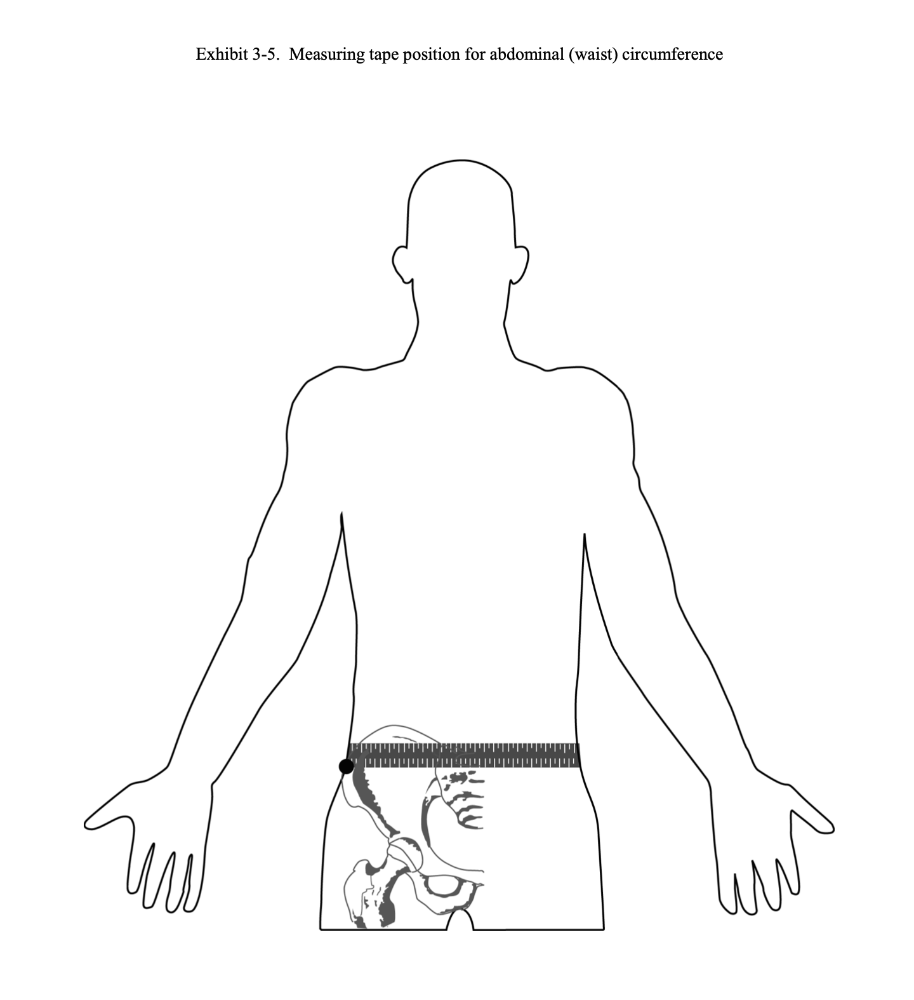

# Ziva Health Baseline Health Score Algorithm
### About this Project
Body Mass Index (BMI) is an immensely popular metric for determining a person's approximate body composition. It has become so widespread that even the National Institute of Health (NIH) has [defined](https://www.nhlbi.nih.gov/sites/default/files/media/docs/obesity-evidence-review.pdf) the thresholds for obesity based entirely on BMI. However, there are major shortcomings with BMI in that it does not account for different body types. For example, an individual may be in excellent shape but still be considered obese by the NIH standards.

This project overcomes the shortcomings inherent with BMI. Our algorithm takes an individual's weight, height, sex (at birth), age, and waist circumference to generate a health score between 0-100% based on the individual's predicted body fat percentage. We generalize a person's health to body fat percentage because body fat levels are so highly correlated with diabetes, heart conditions, and other bodily ailments.

The algorithm for this project is trained on the best data available--from the CDC's National Health and Nutrition Examination Survey (NHANES). Between 1999 and 2006, NHANES measured the body fat composition of 26,427 individuals using [Dual Energy X-ray Absorptiometry (DXA)](https://wwwn.cdc.gov/Nchs/Nhanes/Dxa/Dxa.aspx)--one of the most accurate methods for measuring body fat composition.

This health score algorithm will be implemented into the Ziva Health website (at the 0-100% scale) and the Ziva Health app (at a 0-35% scale, contributing to a more holistic health score). The implementation presented in this repository returns a result on the 0-100% scale, but it can be converted to the app's use case by simply multiplying the score by a factor of $0.35$.

### Using the Algorithm
To generate a score, download this repository, follow the setup instructions below, and then run [02-run_algorithm.py](./src/models/02-run_algorithm.py) from the [src/models/](./src/models/) directory in your terminal.

#### Important Note for Accuracy
In order to return an accurate health score and/or body fat percentage result from the algorithm, it is essential that the inputs (weight, height, age, sex, waist circumference) be measured in the same way they were measured on the subjects in the NHANES dataset. This necessity primarily concerns the measurements for waist circumference.  
  
The algorithm is particularly sensitive to waist circumference and will almost certainly return an exaggerated body fat percentage if the inputted waist circumference is not precise (for example, by using pants size). I strongly recommend prompting the users of this algorithm to measure their waist circumference as outlined by the [NHANES procedure manual for body measurements](https://wwwn.cdc.gov/nchs/data/nhanes/1999-2000/manuals/bm.pdf) (see item 3.3.1.7):
> To define the level at which the waist or abdominal circumference is measured, you must first locate and mark a bony landmark, the lateral border of the ilium. Have the [Sample Participant (SP)] stand and hold the examination gown above the waist. Lower the pants and underclothing of the SP slightly, and standing behind and to the right of the SP, palpate the hip area to locate the right ilium (see Exhibit 3-5). Draw a horizontal line just above the uppermost lateral border of the right ilium and then cross the line to indicate the midaxillary line of the body. Standing on the SP's right side, place the measuring tape around the trunk in a horizontal plane at the level marked on the right side of the trunk. Hold the zero end below the measurement value. Use the mirror on the wall to ensure correct horizontal alignment of the measuring tape. This is especially useful when measuring overweight SPs or women with hourglass-shaped torsos. The recorder should also observe the SP to make sure that the tape is parallel to the floor and that the tape is snug, but does not compress the skin. Make the measurement at the end of a normal expiration and call it to the recorder to the nearest millimeter.
> 
> 

### Setup for Replication
This project uses Anaconda as a package manager. With Anaconda installed on your machine, run `conda env create -f environment.yml` to create a virtual environment with all the necessary dependencies.

# Technical Details
## Data
The data is downloaded and organized from [NHANES](https://wwwn.cdc.gov/nchs/nhanes/Default.aspx), a large source of health data provided by the CDC.

### Retrieval and Organization
For the years 1999-2006, the downloaded data are organized in the following structure [here](./data/raw/) (with directory names `NHANES_1999-2000`, `NHANES_2001-2002`, `NHANES_2003-2004`, `NHANES_2005-2006`):

    ├── data/raw/NHANES_yyyy-yyyy
    │   ├── Demographics
    │   │   └── DEMO.XPT    <- Demographics data
    │   │
    │   ├── Examination
    │   │   ├── BMX.XPT     <- Body measurement data
    │   │   └── dxx.xpt     <- Dual Energy X-ray Absorptiometry (DXA) multiple imputation data
    │   │
    │   └── Questionnaire
    │       ├── SMQ.XPT     <- Smoking and tobacco use data
    │       ├── SMQFAM.XPT  <- Household smoking and tobacco use data
    │       └── SMQMEC.XPT  <- Recent smoking and tobacco use data

We did not use the household smoking and tobacco use nor the recent smoking and tobacco use datasets. To view the documentation for the datasets we used in this project, access the links below:
- Demographics: [1999-2000](https://wwwn.cdc.gov/Nchs/Nhanes/1999-2000/DEMO.htm), [2001-2002](https://wwwn.cdc.gov/Nchs/Nhanes/2001-2002/DEMO_B.htm), [2003-2004](https://wwwn.cdc.gov/Nchs/Nhanes/2003-2004/DEMO_C.htm), [2005-2006](https://wwwn.cdc.gov/Nchs/Nhanes/2005-2006/DEMO_D.htm)
- Body measurements: [1999-2000](https://wwwn.cdc.gov/Nchs/Nhanes/1999-2000/BMX.htm), [2001-2002](https://wwwn.cdc.gov/Nchs/Nhanes/2001-2002/BMX_B.htm), [2003-2004](https://wwwn.cdc.gov/Nchs/Nhanes/2003-2004/BMX_C.htm), [2005-2006](https://wwwn.cdc.gov/Nchs/Nhanes/2005-2006/BMX_D.htm)
- DXA: [1999-2006](https://wwwn.cdc.gov/Nchs/Nhanes/Dxa/Dxa.aspx)
- Smoking and tobacco use: [1999-2000](https://wwwn.cdc.gov/Nchs/Nhanes/1999-2000/SMQ.htm), [2001-2002](https://wwwn.cdc.gov/Nchs/Nhanes/2001-2002/SMQ_B.htm), [2003-2004](https://wwwn.cdc.gov/Nchs/Nhanes/2003-2004/SMQ_C.htm), [2005-2006](https://wwwn.cdc.gov/Nchs/Nhanes/2005-2006/SMQ_D.htm)
    
The `NHANES_2017-Mar2020` directory follows the same general structure as shown above, but with the following exceptions:

- There is no DXA data
- Instead of `SMQMEC.XPT` there is `SMQRTU.XPT`
- There is an additional file `SMQSHS.XPT` for secondhand smoke exposure

Because the data from 2017-2020 do not include DXA data, we disregard it for this project. [01-convert_to_csv.py](./src/data/01-convert_to_csv.py) converts all of the datasets from XPT to CSV, storing them alongside the XPT files in [data/raw](./data/raw/). [02-data_cleaning.py](./src/data/02-data_cleaning.py) cleans the raw CSV files, resulting in the final datasets found in [data/processed](./data/processed/). See [01-eda.ipynb](./notebooks/01-eda.ipynb) for more information about this process.

### Data Thresholds
The participants in the NHANES held demographics/measurements in the following ranges:
|         | Weight               | Height            | Age   | Waist Circumference  |
| :-----: | -------------------- | ----------------- | ----- | -------------------- |
| Minimum | 40.8 lbs (18.5 kg)   | 3'7" (1.1 m)      | 8     | 12.6 in (32.0 cm)    |
| Maximum | 481.9 lbs (218.6 kg) | 6'6" (2.0 m)      | 85    | 698.8 in (175 cm)    |

Because the algorithm is not trained on any data that exceed these thresholds, we cannot rely on the algorithm to generate an accurate score for individuals outside of these ranges.

### Multiple Imputation for DXA Data
Due to missing data in the NHANES dataset, the CDC performed multiple imputation to fill the missing data with highly probable replacement values. However, in order to preserve the statistical variation in the replacement values, each missing value in the data is given five imputations of potential replacement values. In keeping with proper statistical practices, we trained five different Random Forest models (see more details on this in the next section) for each imputation of body fat percentage data. In practice, we our final prediction of the user's body fat percentage is the average of the five outputs from each imputation's model.

## Algorithm
This project uses a random forest algorithm to predict the user's body fat percentage, which is then fed into a custom piecewise function to return a health score between 0 and 1 (or 0-100%). To generate the weighted health score for the app, simply multiply the health score by the weight factor.

We built this custom piecewise function using [this](http://pennshape.upenn.edu/files/pennshape/Body-Composition-Fact-Sheet.pdf) information about healthy body fat percentages.

### Scoring Mechanism
| Scoring Category | Unhumanly Low | Low     | Ideal   | High  | Unhumanly High |
| :--------------: | ------------- | ------- | ------- | ----- | -------------- |
| Scoring Range    | 0-30%         | 30-100% | 100-70% | 30-0% | 0%             |

See the plots [here](./src/models/Rplots.pdf) for more details.

### Deploying the Algorithm
Assuming the environment is properly set up, [this](./src/models/essential_files.zip) zip file contains all the essential files needed to run/replicate the algorithm. All other files in this repository are meant for transparency in the development process. 

## File Structure

    ├── LICENSE
    ├── README.md          <- The top-level README for developers using this project.
    ├── data
    │   ├── interim        <- Intermediate data that has been transformed.
    │   ├── processed      <- The final, canonical data sets for modeling.
    │   └── raw            <- The original, immutable data dump.
    │
    ├── models
    │   └── rf_regressors  <- Saved random forest models (one for each imputation) as pickle
    │                         files.
    │
    ├── notebooks          <- Jupyter notebooks.
    │
    ├── references         <- Research articles informing the baseline algorithms.
    │
    ├── reports            <- Jupyter notebook outputs, saved as HTML and PDF files.
    │
    ├── environment.yml   <- The yaml file for reproducing the analysis environment, e.g.
    │                         generated with `conda env export > environment.yml`
    │
    └── src                <- Source code for use in this project.
        ├── data           <- Scripts to convert XPT datasets to CSV, clean data
        │   ├── 01-convert_to_csv.py
        │   ├── 02-data_cleaning.py
        │   └── 03-generate_scoring_data.py
        │
        └── models         <- Scripts to train and save the algorithm
            ├── 01-train_algorithm.py
            ├── 02-run_algorithm.py
            ├── 03-plot_scoring_algorithm.R
            ├── essential_files.zip
            └── Rplots.pdf
